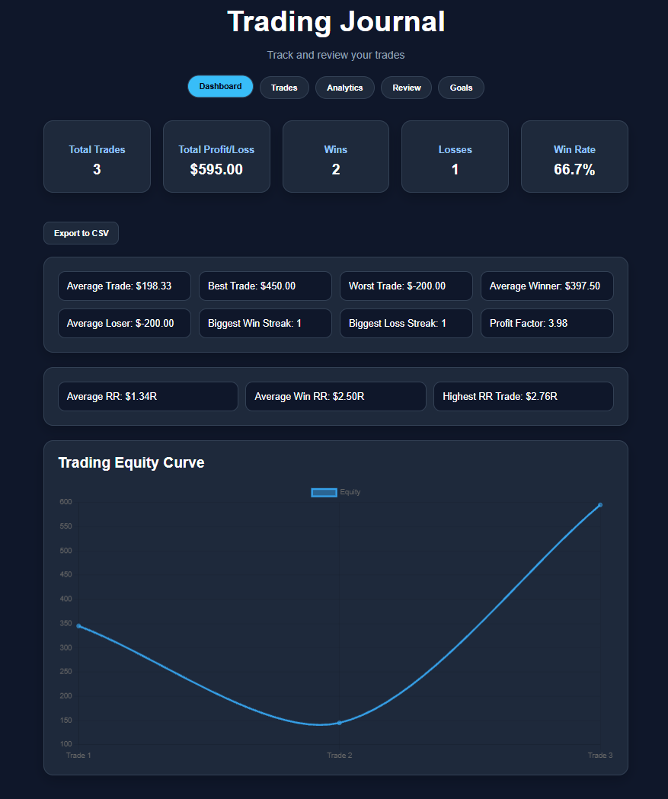
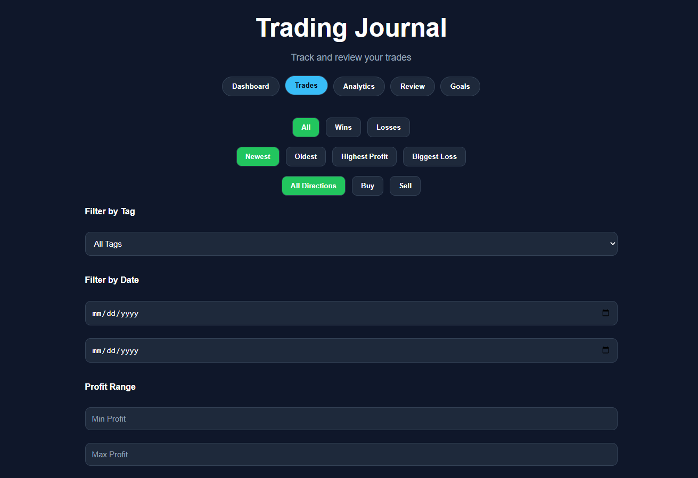
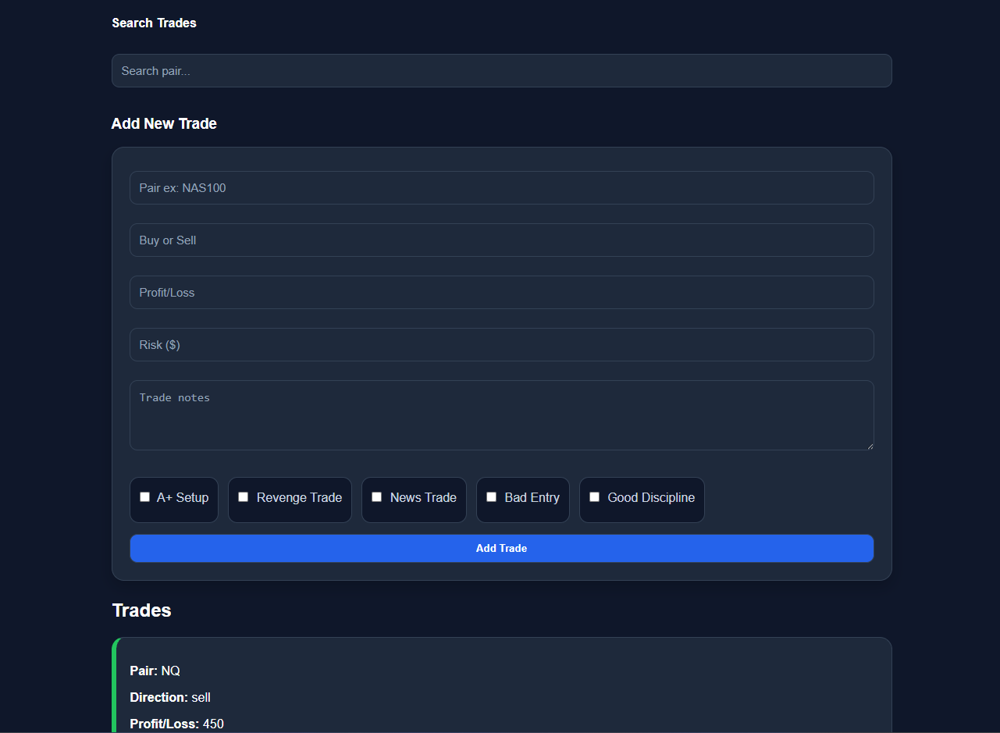
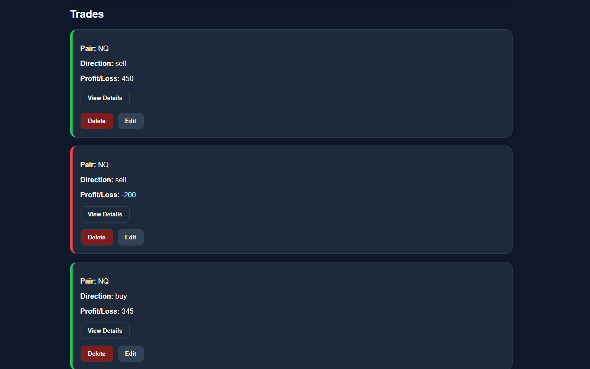
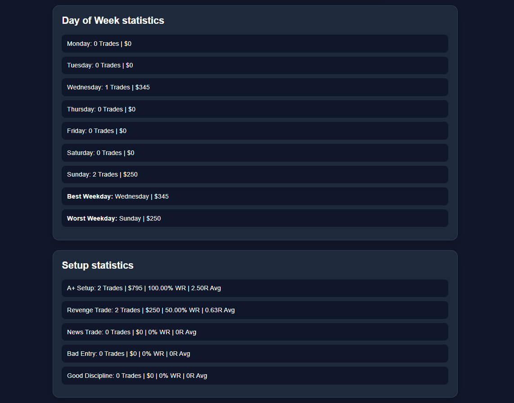
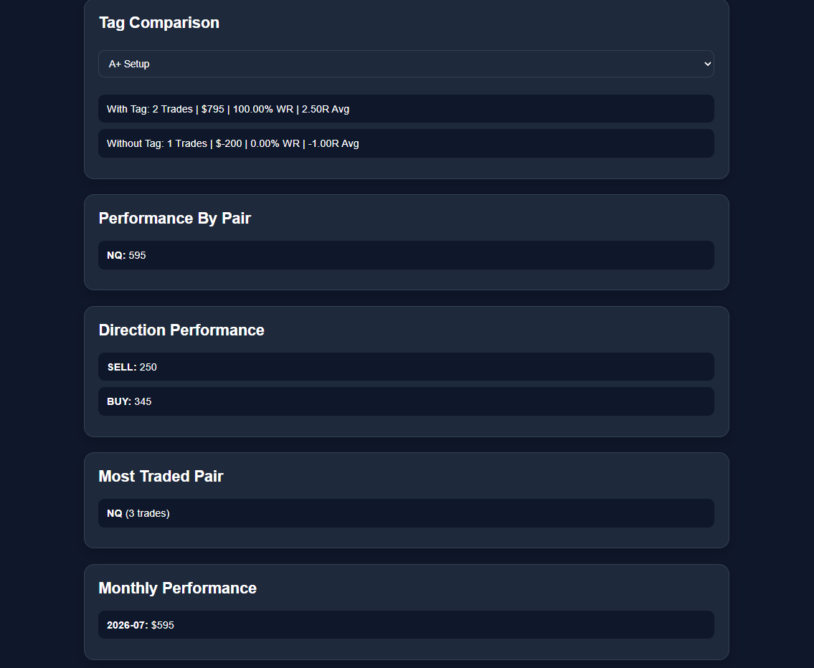
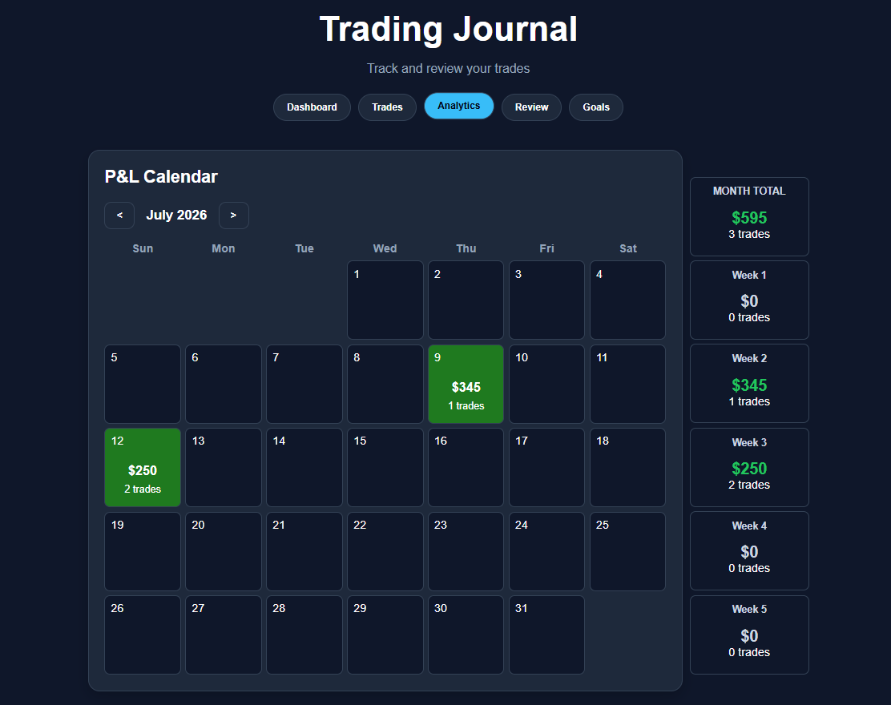
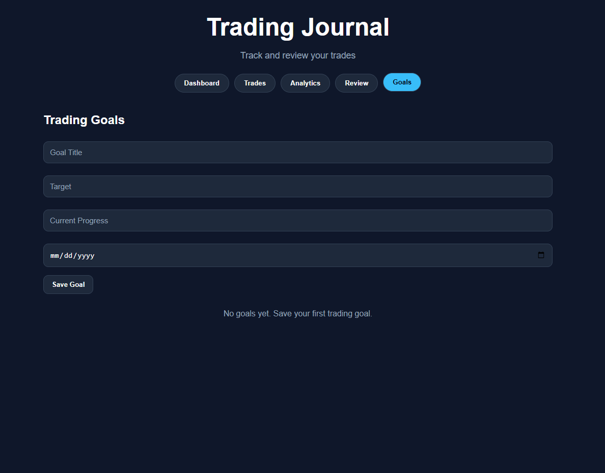
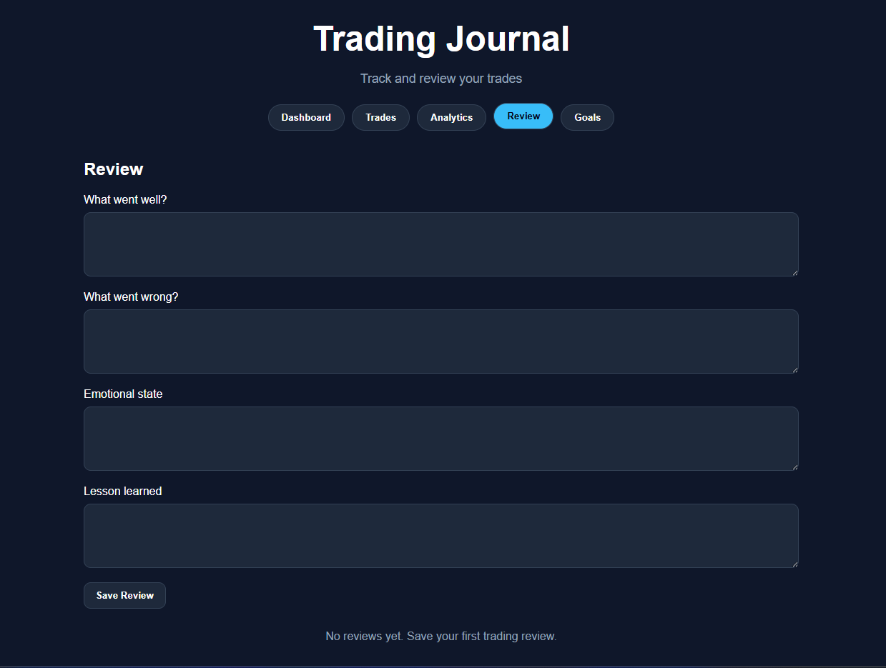

# 📈 Trading Journal

A web-based trading journal designed to help day traders record, analyze, and review their trading performance. The application allows users to log trades, monitor profit and loss, track progress toward trading goals, review past performance, and visualize trading data through an interactive analytics dashboard and P&L calendar.

Built over approximately **2 months** with **2,300+ lines of HTML, CSS, and JavaScript**, this project was created to combine my interest in software development with my experience as a day trader while strengthening my front-end development skills.

---

## Overview

As both a computer science student and an active day trader, I wanted to build a tool that solved a real problem I experienced while trading. Keeping track of trades, identifying recurring mistakes, and measuring long-term performance is essential for improving as a trader, but doing so manually can quickly become disorganized.

The goal of this project was to create a centralized trading journal that makes it easy to record trades, review performance, and identify strengths and weaknesses over time. By combining trade tracking with performance analytics, goal setting, and periodic trade reviews, the application helps users make more informed decisions based on their trading history.

Although the application was originally built for my own trading workflow, it is designed to be useful for any day trader looking for an organized way to analyze and improve their performance.

---

## Features

- **Trade Logging**: Record each trade with details such as trading pair, direction, profit/loss, risk, notes, and custom tags.

- **Performance Dashboard**: View key trading statistics, including total trades, win rate, average risk-to-reward ratio, total profit/loss, and other performance metrics at a glance.

- **Analytics**: Visualise trading performance using charts that display equity growth, trading activity, and other useful statistics to help identify patterns over time.

- **P&L Calendar**: View daily and weekly profit/loss directly on an interactive calendar, making it easy to recognize profitable and unprofitable trading periods.

- **Trade Filtering & Sorting**: Quickly filter trades by direction and organize results using multiple sorting options to analyze specific portions of your trading history.

- **Trading Goals**: Create, edit, and monitor trading goals with progress tracking to help maintain discipline and measure improvement.

- **Trade Reviews**: Document lessons learned after a trading session by recording what went well, what went wrong, emotional state, and key takeaways.

- **Local Data Persistence (LocalStorage)**: All trading information is stored locally in the browser using LocalStorage, allowing data to persist between sessions without requiring a backend database.

- **Modern User Interface**: Clean and organized layout designed to provide a consistent experience across different screen sizes.

---

## Technologies Used

### Frontend
- HTML5
- CSS3
- JavaScript (ES6)

### Libraries
- Chart.js

### Data Storage
- Browser LocalStorage

### Development Tools
- Visual Studio Code
- Git
- GitHub

---

## Screenshots

### Dashboard

Displays an overview of trading performance, including key statistics and the equity curve.

---

### Trade Management

#### Filters

#### Add Trade

#### Trade History

---

### Analytics

#### Performance Statistics

#### Trade Stats

---

### P&L Calendar

---

### Goals

---

### Reviews

---

## Installation

1. Clone the repository.
2. Open the project in Visual Studio Code.
3. Open `public/index.html` in your browser.

---

## How to Use

1. Add new trades.
2. Review your trading statistics.
3. Analyze your performance using charts and the P&L calendar.
4. Set trading goals.
5. Record trade reviews to identify strengths and weaknesses.

---

## Challenges

The most challenging part of this project was building the interactive P&L calendar. It required generating a dynamic monthly calendar while correctly tracking dates, calculating daily and weekly profit/loss, and updating as users navigated between months.

---

## What I Learned

This project strengthened my ability to organize a larger JavaScript application as it grew in complexity. I gained experience structuring front-end code, managing application state with LocalStorage, manipulating the DOM, and building reusable features across multiple sections of the application.

---

## Future Improvements

- User authentication
- Cloud database integration
- Multiple trading accounts
- Trade screenshot uploads
- Performance reports and advanced analytics
- Mobile-friendly optimization

---

## Author

**Jason Anagho**

Computer Science Student at Kennesaw State University

# 📈 Trading Journal

A web-based trading journal designed to help day traders record, analyze, and review their trading performance. The application allows users to log trades, monitor profit and loss, track progress toward trading goals, review past performance, and visualize trading data through an interactive analytics dashboard and P&L calendar.

Built over approximately **2 months** with **2,300+ lines of HTML, CSS, and JavaScript**, this project was created to combine my interest in software development with my experience as a day trader while strengthening my front-end development skills.

---

## Overview

As both a computer science student and an active day trader, I wanted to build a tool that solved a real problem I experienced while trading. Keeping track of trades, identifying recurring mistakes, and measuring long-term performance is essential for improving as a trader, but doing so manually can quickly become disorganized.

The goal of this project was to create a centralized trading journal that makes it easy to record trades, review performance, and identify strengths and weaknesses over time. By combining trade tracking with performance analytics, goal setting, and periodic trade reviews, the application helps users make more informed decisions based on their trading history.

Although the application was originally built for my own trading workflow, it is designed to be useful for any day trader looking for an organized way to analyze and improve their performance.

---

## Features

- **Trade Logging**: Record each trade with details such as trading pair, direction, profit/loss, risk, notes, and custom tags.

- **Performance Dashboard**: View key trading statistics, including total trades, win rate, average risk-to-reward ratio, total profit/loss, and other performance metrics at a glance.

- **Analytics**: Visualise trading performance using charts that display equity growth, trading activity, and other useful statistics to help identify patterns over time.

- **P&L Calendar**: View daily and weekly profit/loss directly on an interactive calendar, making it easy to recognize profitable and unprofitable trading periods.

- **Trade Filtering & Sorting**: Quickly filter trades by direction and organize results using multiple sorting options to analyze specific portions of your trading history.

- **Trading Goals**: Create, edit, and monitor trading goals with progress tracking to help maintain discipline and measure improvement.

- **Trade Reviews**: Document lessons learned after a trading session by recording what went well, what went wrong, emotional state, and key takeaways.

- **Local Data Persistence (LocalStorage)**: All trading information is stored locally in the browser using LocalStorage, allowing data to persist between sessions without requiring a backend database.

- **Modern User Interface**: Clean and organized layout designed to provide a consistent experience across different screen sizes.

---

## Technologies Used

### Frontend
- HTML5
- CSS3
- JavaScript (ES6)

### Libraries
- Chart.js

### Data Storage
- Browser LocalStorage

### Development Tools
- Visual Studio Code
- Git
- GitHub

---

## Screenshots

### Dashboard

Displays an overview of trading performance, including key statistics and the equity curve.

---

### Trade Management

#### Filters

#### Add Trade

#### Trade History

---

### Analytics

#### Performance Statistics

#### Trade Stats

---

### P&L Calendar

---

### Goals

---

### Reviews

---

## Installation

1. Clone the repository.
2. Open the project in Visual Studio Code.
3. Open `public/index.html` in your browser.

---

## How to Use

1. Add new trades.
2. Review your trading statistics.
3. Analyze your performance using charts and the P&L calendar.
4. Set trading goals.
5. Record trade reviews to identify strengths and weaknesses.

---

## Challenges

The most challenging part of this project was building the interactive P&L calendar. It required generating a dynamic monthly calendar while correctly tracking dates, calculating daily and weekly profit/loss, and updating as users navigated between months.

---

## What I Learned

This project strengthened my ability to organize a larger JavaScript application as it grew in complexity. I gained experience structuring front-end code, managing application state with LocalStorage, manipulating the DOM, and building reusable features across multiple sections of the application.

---

## Future Improvements

- User authentication
- Cloud database integration
- Multiple trading accounts
- Trade screenshot uploads
- Performance reports and advanced analytics
- Mobile-friendly optimization

---

## Author

**Jason Anagho**

Computer Science Student at Kennesaw State University